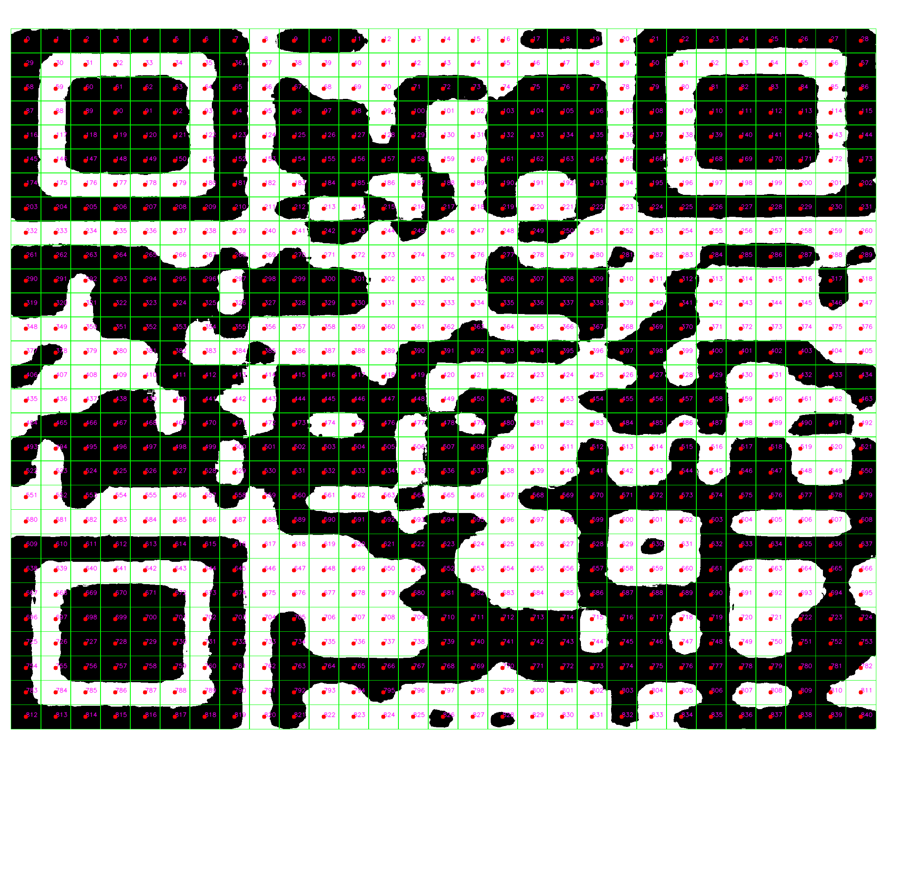

# QR Code Sharpener

This Python program tries to recreate a QR code from photo that might be blurry or warped.

Improved upon the original TypeScript version [here](https://github.com/haraldF/qrsharpener/tree/master).

## Prerequisite

```bash
pip install opencv-python
```

## Usage

```bash
python qr_sharpener.py ./QR_photo.jpg
```

## Arguments

`qr_sharpener.py [-h] [--qr_dim QR_DIM] [--size SIZE] [--debug] filepath`

Positional arguments:

- `filepath`: Input image file path

Options:
  
- `-h, --help`: show this help message and exit

- `--qr_dim QR_DIM`: The dimension of your QR code. Default is 29 (QR code version 3). Only used when this parameter cannot be
                   detected automatically.

- `--size SIZE`: Output QR code size. A value of 0 (default) means the size will be automatically determined.

- `--debug`: Enable debug mode, which will print and show intermediate results.

## Test case 1

The input photo is a unprocessed photo taken by phone.


This program first finds the QR code's bounding box:


And warps it:


Then automatically determines the QR dimension and process individual tiles:


Finally, the program outputs the recreated QR code:


## Test case 2

The input is a blury photo of a QR code, provided [here](https://github.com/haraldF/qrsharpener/tree/master). Some modifications including adding white borders and transforming to rectangular shape have been applied to the blurry QR code to make it even harder to recreate.


The program uses the user defined parameter (`qr_dim = 29`) and process individual tiles:



**Note**: Make sure the input image is cropped to the QR code only without any warping (white borders are fine since they will be automatically removed), otherwise the program will not work.

Finally, the program outputs the recreated QR code:


